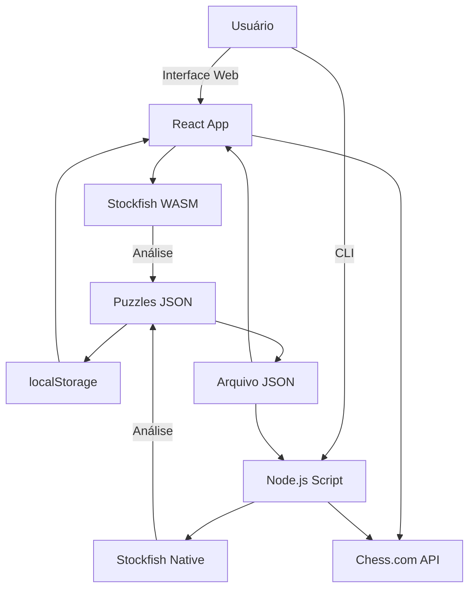

<div align="center">

# ♟️ Chess Training System

### Sistema Completo de Treinamento de Xadrez com IA

[](https://github.com/frederico-kluser/opening-training)
[](LICENSE)
[](https://reactjs.org/)
[](https://www.typescriptlang.org/)
[](https://nodejs.org/)
[](https://vitejs.dev/)
[](https://stockfishchess.org/)

<p align="center">
  <strong>Análise de partidas com Stockfish 17 • Puzzles táticos inteligentes • Repertório de aberturas personalizado</strong>
</p>

[Começar](#-quick-start) •
[Documentação](#-documentação) •
[Features](#-features) •
[CLI Tool](#-cli-tool-análise-ultra-rápida) •
[Roadmap](#-roadmap)

---

</div>

## 🎯 Visão Geral

Plataforma completa para treino de xadrez que combina análise automatizada de partidas com **Stockfish 17**, geração inteligente de puzzles táticos personalizados e sistema de repertório de aberturas. Agora com **ferramenta CLI ultra-rápida** para análise (16x mais rápida que a versão web) e download automático de partidas do Chess.com.

### 🌟 Diferenciais

- **🔥 16.67x Mais Rápido**: Análise via CLI com Stockfish nativo e multi-threading
- **🤖 Validação Inteligente**: Puzzles que aceitam qualquer movimento que melhore a posição (não apenas um específico)
- **📊 Evaluation Bar em Tempo Real**: Visualização da avaliação da posição conforme você joga
- **🌐 Integração Chess.com**: Download automático de partidas por username
- **📚 Sistema de Aberturas v2.0**: Cadastro com escolha de cor e treino personalizado
- **💾 Análises Reutilizáveis**: Exporte e importe análises completas em JSON

---

## 📋 Table of Contents

- [Quick Start](#-quick-start)
- [CLI Tool - Análise Ultra-Rápida](#-cli-tool-análise-ultra-rápida)
- [Features](#-features)
- [Instalação](#-instalação)
- [Uso - Interface Web](#-uso---interface-web)
- [Uso - CLI](#-uso---cli)
- [Stack Tecnológico](#-stack-tecnológico)
- [Arquitetura](#-arquitetura)
- [Roadmap](#-roadmap)
- [Contribuindo](#-contribuindo)
- [FAQ](#-faq)
- [Changelog](#-changelog)
- [Licença](#-licença)

---

## ⚡ Quick Start

```bash
# Clone o repositório
git clone https://github.com/frederico-kluser/opening-training.git
cd opening-training

# Instale as dependências
npm install

# Execute a interface web
npm run dev
# Acesse http://localhost:5173

# OU use a CLI ultra-rápida (requer Stockfish instalado)
npm run analyze:user hikaru
```

### 🎮 Demo

> **Nota**: Adicione screenshots ou GIFs demonstrando as principais funcionalidades:
> - Interface de análise de partidas
> - Sistema de puzzles com evaluation bar
> - Editor de repertório de aberturas
> - CLI tool em ação

---

## 🚀 CLI Tool: Análise Ultra-Rápida

### 16.67x Mais Rápido que WASM!

Analise suas partidas usando **Stockfish nativo** diretamente no terminal com multi-threading completo.

#### Performance Comparativa

| Método | Velocidade | Tempo (40 movimentos) | Speedup |
|--------|------------|----------------------|---------|
| **WASM (Browser)** | 900 knodes/s | ~10 minutos | 1x |
| **Native 1 thread** | 1,500 knodes/s | ~6 minutos | 1.67x |
| **Native 16 threads** | **15,000 knodes/s** | **~36 segundos** | **16.67x** ⚡ |

#### Uso da CLI

```bash
# Analisar arquivo PGN local
npm run analyze partidas.pgn

# Download automático do Chess.com
npm run analyze:user SEU_USUARIO

# Exemplos com jogadores famosos
npm run analyze:user hikaru
npm run analyze:user MagnusCarlsen
npm run analyze:user GothamChess

# Com opções personalizadas
npm run analyze:user hikaru -- --months 6 --depth 20 --threshold 150 --threads 8
```

#### Opções Disponíveis

| Opção | Descrição | Padrão |
|-------|-----------|--------|
| `--username` | Usuário Chess.com | - |
| `--months` | Meses a baixar | 3 |
| `--depth` | Profundidade Stockfish | 18 |
| `--threshold` | CP mínimo para puzzle | 100 |
| `--threads` | Threads CPU | Todos |
| `--output` | Arquivo de saída | puzzles-output.json |

#### Features da CLI

- ✅ **Download automático** de partidas do Chess.com por username
- ✅ **Rate limiting inteligente** (respeita limites da API - 1s entre requests)
- ✅ **Multi-threading completo** (usa todos os cores da CPU)
- ✅ **Barra de progresso** em tempo real com feedback colorido
- ✅ **Output JSON** compatível com interface web
- ✅ **PGN temporário** salvo automaticamente para backup
- ✅ **Estatísticas detalhadas** (posições/segundo, velocidade, tempo)

#### 📚 Documentação CLI

- **[📖 Guia de Análise Rápida](scripts/ANALISE-ULTRA-RAPIDA.md)** - Começar imediatamente
- **[📖 Guia Completo da CLI](scripts/README.md)** - Todas as opções e configurações (6000+ palavras)
- **[🌐 Guia Chess.com](scripts/CHESS-COM-GUIDE.md)** - Download automático de partidas
- **[⚡ Análise de Performance](PERFORMANCE_ANALYSIS.md)** - Comparação técnica WASM vs Native

---

## ✨ Features

### 1. 📊 Análise de Partidas com Stockfish 17

<details>
<summary><strong>Ver detalhes</strong></summary>

#### Interface Web (WASM)
- ✅ Análise profunda (depth 18) com Stockfish WASM
- ✅ Importação de múltiplas partidas via PGN ou Chess.com
- ✅ **Importação direta via FEN** com barra de progresso
- ✅ Detecção automática do jogador mais frequente (badge 🎯)
- ✅ Pré-seleção inteligente de partidas para análise
- ✅ Cálculo de **ACPL** (Average Centipawn Loss) separado por cor
- ✅ Classificação em **6 categorias**:
  - 💎 **Brilliant** (< 0 cp loss)
  - ✨ **Best** (< 10 cp loss)
  - ✅ **Good** (< 50 cp loss)
  - ⚠️ **Inaccuracy** (< 100 cp loss)
  - ❌ **Mistake** (< 300 cp loss)
  - 💥 **Blunder** (≥ 300 cp loss)
- ✅ **Exportação/Importação** de análises em JSON
- ✅ Auto-salvamento de puzzles no localStorage

#### CLI Tool (Native)
- ✅ **16.67x mais rápido** com Stockfish nativo
- ✅ Multi-threading completo
- ✅ Download automático Chess.com
- ✅ Feedback em tempo real com barra de progresso
- ✅ Output compatível com interface web

</details>

### 2. 🧩 Sistema de Puzzles Táticos Inteligentes

<details>
<summary><strong>Ver detalhes</strong></summary>

#### Geração Automática
- ✅ Puzzles criados a partir de **blunders** (> 300cp)
- ✅ Ignora primeiros 10 lances (teoria de abertura)
- ✅ Sistema de contexto visual (mostra posição anterior)

#### 🆕 Evaluation Bar em Tempo Real
- ✅ Barra visual mostrando vantagem de brancas/pretas
- ✅ Integração com Stockfish (depth 12) para avaliação em tempo real
- ✅ Sequência progressiva de avaliações:
  1. Avalia posição de contexto (antes do movimento do oponente)
  2. Avalia posição inicial do puzzle
  3. Avalia após movimento do jogador
  4. Restaura avaliação inicial após erro (800ms delay)
- ✅ Fórmula de conversão Lichess (centipawns → win percentage)
- ✅ Animações suaves (0.6s cubic-bezier)

#### 🆕 Validação Inteligente de Movimentos
- ✅ **Não compara com movimento específico pré-definido**
- ✅ Valida baseado em **melhoria da posição**:
  - **Brancas**: Correto se avaliação aumenta (mais positivo)
  - **Pretas**: Correto se avaliação diminui (mais negativo)
- ✅ Aceita **múltiplas soluções corretas**
- ✅ Mais educativo: ensina a melhorar, não decorar
- ✅ Logs de debug detalhados no console

#### Três Modos de Treinamento
- **🎯 Modo Normal**: Puzzles embaralhados sem repetição, progresso linear
- **⚡ Modo Rush**: 20 puzzles aleatórios com repetição permitida (treino intensivo)
- **♟️ Modo Opening**: Foco em erros de abertura (apenas movimentos 1-10)

#### Sistema de Tentativas e Feedback
- ✅ Máximo **3 tentativas** com feedback progressivo
- ✅ Auto-skip após 3 erros
- ✅ Feedback colorido com transição suave (0.5s):
  - 🟢 Verde (#90EE90) para movimento correto
  - 🔴 Rosa (#FFB6C1) para movimento incorreto
- ✅ Estatísticas globais persistentes (streak, taxa de acerto, timer)

</details>

### 3. 📚 Repertório de Aberturas v2.0

<details>
<summary><strong>Ver detalhes</strong></summary>

#### Cadastro e Edição
- ✅ **🆕 Escolha de cor** (branco/preto) no cadastro
- ✅ Sistema de navegação em árvore com múltiplas variantes
- ✅ Comentários personalizados por posição FEN
- ✅ Undo/Redo com atalhos de teclado
- ✅ Import/Export em JSON com validação
- ✅ Persistência completa no localStorage

#### Modo Treino Personalizado
- ✅ **🆕 Respeita a cor escolhida** no cadastro
- ✅ **🆕 Mostra movimento do oponente** primeiro (quando aplicável)
- ✅ 20 posições aleatórias (Fisher-Yates shuffle)
- ✅ Máximo 3 tentativas por posição
- ✅ **Dica automática após 2 erros** (mostra comentário)
- ✅ Orientação automática do tabuleiro baseada na cor
- ✅ **🆕 Utilities compartilhadas** para evitar DRY code

#### Estrutura de Dados
```typescript
interface Opening {
  id: string;
  name: string;
  description?: string;
  color: 'white' | 'black';  // 🆕 Cor escolhida pelo usuário
  dateCreated: string;
  lastModified: string;
  positions: {
    [fen: string]: {
      prevFen: string;
      comment: string;
      nextFen: string[];
    };
  };
  stats?: {
    totalPositions: number;
    correctMoves: number;
    incorrectMoves: number;
    accuracy: number;
  };
}
```

</details>

### 4. 🎨 Interface e UX

<details>
<summary><strong>Ver detalhes</strong></summary>

- ✅ **Tema escuro/claro** com toggle persistente (🌙/☀️)
- ✅ **Versão automática** no header (importa de package.json)
- ✅ **Interface home redesenhada**:
  - 3 cards principais focados (Analisar, Puzzles, Aberturas)
  - GitHub no footer com licença MIT
  - Layout limpo e objetivo
- ✅ **Navegação melhorada**:
  - Botões "← Voltar" em todos os treinamentos
  - Posicionados no topo direito (sempre visíveis)
- ✅ Design **responsivo** para mobile e tablets
- ✅ Transições suaves entre temas (0.3s ease)
- ✅ Persistência de preferências no localStorage

</details>

---

## 🛠️ Instalação

### Pré-requisitos

- **Node.js** 18+ e npm
- **Navegador moderno** com suporte a Web Workers (para interface web)
- **Stockfish nativo** (opcional, apenas para CLI ultra-rápida)

### Interface Web

```bash
# Clone o repositório
git clone https://github.com/frederico-kluser/opening-training.git
cd opening-training

# Instale as dependências
npm install

# Execute em modo desenvolvimento
npm run dev

# Build para produção
npm run build
npm run preview
```

Acesse http://localhost:5173

### CLI Tool (Análise Ultra-Rápida)

Para usar a ferramenta CLI com Stockfish nativo:

#### macOS (Homebrew)
```bash
brew install stockfish
```

#### Linux (Ubuntu/Debian)
```bash
sudo apt install stockfish
```

#### Linux (Fedora)
```bash
sudo dnf install stockfish
```

#### Windows
1. Baixe de https://stockfishchess.org/download/
2. Adicione ao PATH do sistema

#### Verificar Instalação
```bash
stockfish
# Deve abrir o UCI prompt. Digite "quit" para sair.
```

---

## 📖 Uso - Interface Web

### 1. Análise de Partidas

1. Clique em **"📊 Analisar Partidas"**
2. Escolha uma opção de importação:
   - **Importar PGN**: Cole suas partidas ou use o exemplo
   - **Chess.com**: Digite username e escolha modo:
     - Importar Todos (jogos do mês)
     - Importar Apenas Meus Jogos
     - Importar Últimos 10 (rápido)
   - **♟️ Importar do Chess.com**: Importação direta via FEN
   - **📥 Importar Análise**: Carregue análises salvas (JSON)
3. Para múltiplas partidas:
   - Jogador mais frequente detectado automaticamente (badge 🎯)
   - Partidas pré-selecionadas
   - Escolha a cor para análise
4. Aguarde a análise (depth 18, timeout 10s por posição)
5. Veja estatísticas separadas por cor (ACPL, erros)
6. **💾 Exportar Análise** para reutilizar depois

### 2. Treinamento de Puzzles

1. Clique em **"🧩 Treinar Puzzles"**
2. Escolha o modo:
   - **Normal**: Sem repetição, progresso linear
   - **Rush**: 20 puzzles aleatórios com repetição
   - **Opening**: Apenas erros de abertura (movimentos 1-10)
3. Observe o contexto (posição anterior por 1 segundo)
4. Resolva o puzzle (máximo 3 tentativas):
   - 🟢 Verde = movimento correto
   - 🔴 Rosa = movimento incorreto
   - Após 3 erros, avança automaticamente
5. Acompanhe:
   - Evaluation bar em tempo real
   - Progresso da sessão
   - Taxa de acerto e streak
   - Timer

### 3. Repertório de Aberturas

1. Clique em **"📚 Treinar Aberturas"**
2. Opções:
   - **Continuar**: Carrega dados salvos
   - **Novo**: Cria novo repertório
   - **Importar**: Carrega JSON
3. **Modo Edição**:
   - Faça movimentos para criar variantes
   - **Escolha a cor** (branco/preto)
   - Adicione comentários por posição
   - Use Undo/Redo
   - Exporte com botão Download
4. **Modo Treino**:
   - 20 posições aleatórias
   - Máximo 3 tentativas
   - Dica após 2 erros (mostra comentário)
   - Tabuleiro orientado pela cor escolhida

---

## 💻 Uso - CLI

### Comandos Básicos

```bash
# Analisar arquivo PGN local
npm run analyze caminho/para/partidas.pgn

# Download automático Chess.com
npm run analyze:user SEU_USUARIO
```

### Exemplos Práticos

```bash
# Analisar últimos 3 meses do Hikaru
npm run analyze:user hikaru

# Últimos 6 meses com análise profunda
npm run analyze:user MagnusCarlsen -- --months 6 --depth 20

# Apenas erros graves (>200cp)
npm run analyze:user GothamChess -- --threshold 200

# Configuração completa personalizada
npm run analyze:user seu_usuario -- \
  --months 12 \
  --depth 22 \
  --threshold 150 \
  --threads 8 \
  --output minha-analise.json
```

### Análise de Performance

```bash
# Exemplo de output da CLI
🚀 ANÁLISE ULTRA-RÁPIDA DE PGN - STOCKFISH NATIVO

Configuração:
  📊 Profundidade: 18
  🧵 Threads: 16 (16x mais rápido que WASM)
  📉 Threshold: 100cp
  💾 Output: puzzles-output.json

🌐 Baixando partidas do Chess.com...
✅ 142 partida(s) baixada(s)

🔍 Parseando partidas...
✅ 142 partida(s) encontrada(s)

━━━━━━━━━━━━━━━━━━━━━━━━━━━━━━━━━━━━━━━━━━━━━━━━━━━━━━━━━━
⬜ Analisando: [████████████████████] 100% (34/34)
  💥 ERRO ENCONTRADO! Perda de 245cp - Puzzle #1 criado
✅ Partida analisada! Erros encontrados: 2
━━━━━━━━━━━━━━━━━━━━━━━━━━━━━━━━━━━━━━━━━━━━━━━━━━━━━━━━━━

╔════════════════════════════════════════════════════════════╗
║                    ✅ ANÁLISE COMPLETA!                    ║
╚════════════════════════════════════════════════════════════╝

Estatísticas:
  🎮 Partidas analisadas: 142
  📊 Posições analisadas: 3,456
  💥 Erros encontrados: 187
  ⏱️  Tempo decorrido: 384.2s (6.4 minutos)
  📁 Arquivo salvo: puzzles-output.json

Performance:
  🚀 Velocidade: ~9.0 posições/segundo
  ⚡ Speedup: 16x mais rápido que WASM
```

### Importar Resultados na Interface Web

Os puzzles gerados pela CLI podem ser importados diretamente na interface web:

1. Abra a interface web (http://localhost:5173)
2. Vá em **"🧩 Treinar Puzzles"**
3. Os puzzles do arquivo JSON serão carregados automaticamente
4. Ou use o botão de importação para carregar outro arquivo

---

## 🏗️ Stack Tecnológico

### Frontend

| Tecnologia | Versão | Uso |
|------------|--------|-----|
| **React** | 18.3.1 | Interface de usuário |
| **TypeScript** | 5.6.2 | Type safety |
| **Vite** | 5.4.10 | Build tool |
| **React Bootstrap** | 2.10.5 | Componentes UI |
| **React Icons** | 5.3.0 | Ícones |

### Bibliotecas de Xadrez

| Biblioteca | Versão | Uso |
|------------|--------|-----|
| **chess.js** | 1.0.0-beta.8 | Engine de validação de movimentos |
| **react-chessboard** | 4.7.2 | Tabuleiro interativo |
| **Stockfish 17 WASM** | 17 | Engine de análise (browser) |

### Backend/CLI

| Tecnologia | Uso |
|------------|-----|
| **Node.js** | Runtime para CLI tool |
| **Stockfish Native** | Engine de análise (nativo) |
| **Chess.com Public API** | Download de partidas |

### Utilitários

| Biblioteca | Versão | Uso |
|------------|--------|-----|
| **uuid** | 13.0.0 | Identificadores únicos |
| **events** | 3.3.0 | Event emitters |

---

## 🏗️ Arquitetura

### Estrutura de Diretórios

```
opening-training/
├── src/                      # Código fonte da interface web
│   ├── components/           # Componentes React
│   │   ├── ChessBoard/      # Wrapper do tabuleiro
│   │   ├── ChessComImporter/# Importação Chess.com
│   │   ├── ChessGame/       # Tabuleiro interativo
│   │   ├── EvaluationBar/   # 🆕 Barra de avaliação em tempo real
│   │   ├── GameAnalyzer/    # Análise de partidas
│   │   ├── OpeningTrainer/  # Treino de aberturas
│   │   ├── PuzzleTrainer/   # Interface de puzzles
│   │   └── ...
│   ├── hooks/
│   │   └── useStockfish.ts  # Hook para Stockfish
│   ├── Pages/
│   │   └── Register/        # Editor de repertório
│   ├── services/
│   │   ├── ChessComService.ts       # API Chess.com (web)
│   │   ├── OpeningService.ts        # 🆕 CRUD de aberturas v2.0
│   │   ├── OpeningTrainerService.ts # Lógica de treino
│   │   ├── PuzzleService.ts         # Gestão de puzzles
│   │   └── StockfishService.ts      # Engine de análise
│   ├── stockfish/           # Arquivos Stockfish WASM
│   ├── types/
│   │   ├── Opening.ts       # 🆕 Interface Opening expandida v2.0
│   │   ├── Puzzle.ts        # Interface Puzzle
│   │   └── TypeStorage.ts   # Schema repertório
│   ├── utils/
│   │   ├── chessUtils.ts    # Utilidades xadrez
│   │   ├── pgnParser.ts     # Parser PGN
│   │   ├── trainerUtils.ts  # 🆕 Shared utils (evita DRY)
│   │   └── ...
│   ├── App.tsx              # Roteamento principal
│   └── main.tsx             # Entry point
│
├── scripts/ ⚡               # CLI Tool (NOVO)
│   ├── analyze-pgn.js       # 🆕 Script principal de análise
│   ├── stockfish-native.js  # 🆕 Wrapper UCI Stockfish nativo
│   ├── chess-com-api.js     # 🆕 Cliente Chess.com API
│   ├── package.json         # 🆕 Configuração CommonJS
│   ├── example.pgn          # 🆕 Arquivo de exemplo
│   ├── README.md            # 🆕 Documentação completa (6000+ palavras)
│   ├── ANALISE-ULTRA-RAPIDA.md # 🆕 Guia quick-start
│   └── CHESS-COM-GUIDE.md   # 🆕 Guia Chess.com
│
├── dist/                    # Build de produção
├── node_modules/            # Dependências
├── PERFORMANCE_ANALYSIS.md  # 🆕 Análise de performance técnica
├── package.json             # Configuração do projeto
├── vite.config.ts           # Configuração Vite
├── tsconfig.json            # Configuração TypeScript
└── README.md                # Este arquivo
```

### Fluxo de Dados



### Principais Algoritmos

#### 1. Fisher-Yates Shuffle
Embaralhamento verdadeiramente aleatório de puzzles e posições:

```typescript
for (let i = array.length - 1; i > 0; i--) {
  const j = Math.floor(Math.random() * (i + 1));
  [array[i], array[j]] = [array[j], array[i]];
}
```

#### 2. Conversão UCI ↔ SAN
Compatibilidade entre Stockfish (UCI) e chess.js (SAN):

```typescript
convertUCItoSAN('e2e4', fen) // => 'e4'
moveToUCI('e2', 'e4', 'q')   // => 'e2e4q'
```

#### 3. Cálculo de ACPL
Average Centipawn Loss por cor:

```typescript
const calculateACPL = (moves) => {
  const totalCPL = moves.reduce((sum, m) => sum + m.centipawnLoss, 0);
  return Math.round(totalCPL / moves.length);
};
```

#### 4. Evaluation Bar (Lichess Formula)
Conversão de centipawns para porcentagem de vitória:

```typescript
centipawnsToWinPercentage(cp: number): number {
  // Fórmula do Lichess
  return 50 + 50 * (2 / (1 + Math.exp(-0.00368208 * cp)) - 1);
}
```

---

## 📦 Estrutura de Dados

### Puzzle

```typescript
interface Puzzle {
  id: string;              // UUID v4 único
  fenBefore: string;       // Posição antes do erro
  fenContext?: string;     // Posição anterior para contexto (NOVO)
  blunderMove: string;     // Movimento que foi um blunder
  solution: string;        // Movimento correto (UCI ou SAN)
  evaluation: number;      // CP loss do blunder
  moveNumber: number;      // Número do lance
  color: 'white' | 'black';
  dateCreated: string;     // ISO 8601
  attempts?: number;       // Contador de tentativas (max: 3)
  solved?: boolean;        // Status de resolução
  lastAttempt?: string;    // Último movimento tentado
}
```

### Opening (v2.0)

```typescript
interface Opening {
  id: string;
  name: string;
  description?: string;
  color: 'white' | 'black';      // 🆕 Cor escolhida pelo usuário
  dateCreated: string;
  lastModified: string;
  lastPracticed?: string;
  positions: {
    [fen: string]: {
      prevFen: string;      // FEN anterior (para Undo)
      comment: string;      // Comentário da posição
      nextFen: string[];    // Próximas variantes (múltiplas)
    };
  };
  stats?: {
    totalPositions: number;
    correctMoves: number;
    incorrectMoves: number;
    accuracy: number;
    timesCompleted: number;
  };
}
```

### localStorage Keys

| Chave | Estrutura | Descrição |
|-------|-----------|-----------|
| `chess-puzzles` | `Puzzle[]` | Lista de puzzles gerados |
| `opening-training-stats` | `TrainingStats` | Estatísticas do repertório |
| `opening-training-session` | `TrainingSession` | Sessão atual de treino |
| `data` | `TypeStorage` | Repertório de aberturas |
| `darkMode` | `boolean` | Preferência de tema |

---

## 🚀 Roadmap

### v2.2.0 - Q2 2025

- [ ] **Sistema de Spaced Repetition** com algoritmo SM-2
- [ ] **Dashboard com gráficos** de evolução temporal (Chart.js)
- [ ] **Filtros avançados** para puzzles:
  - Por tipo de erro (blunder, mistake, inaccuracy)
  - Por cor (brancas, pretas)
  - Por fase do jogo (abertura, meio-jogo, final)
  - Por rating do adversário
- [ ] **Configuração de Stockfish** via UI (depth, timeout, hash, threads)
- [ ] **Exportação de estatísticas** em PDF

### v2.3.0 - Q3 2025

- [ ] **Integração com Lichess API**
  - Download de partidas
  - Sincronização de estudos
  - Import de puzzles táticos
- [ ] **Análise de padrões** de erro recorrentes
  - ML para detectar fraquezas
  - Sugestões personalizadas de estudo
- [ ] **Sistema de tags** para puzzles
- [ ] **Modo multiplayer** para competições de puzzles

### v3.0.0 - Q4 2025

- [ ] **App mobile** (React Native)
  - Sincronização com versão web
  - Modo offline
- [ ] **Integração com engines alternativos**:
  - Leela Chess Zero (neural network)
  - Comparação de análises
- [ ] **Sistema de coaching** com IA
  - Análise de estilo de jogo
  - Recomendações personalizadas
- [ ] **Marketplace de repertórios**
  - Compartilhamento comunitário
  - Repertórios de GMs

### Futuro (Long-term)

- [ ] **Backend próprio** (Node.js + PostgreSQL)
- [ ] **Sistema de usuários** com autenticação
- [ ] **Cloud storage** para análises
- [ ] **Análise de vídeo** (integração com YouTube/Twitch)
- [ ] **Torneios online** de puzzles
- [ ] **API pública** para desenvolvedores

---

## 🤝 Contribuindo

Contribuições são muito bem-vindas! Este projeto é open-source e cresce com a comunidade.

### Como Contribuir

1. **Fork** o projeto
2. Crie uma **feature branch**: `git checkout -b feature/MinhaNovaFeature`
3. **Commit** suas mudanças: `git commit -m 'feat: adiciona nova funcionalidade'`
4. **Push** para a branch: `git push origin feature/MinhaNovaFeature`
5. Abra um **Pull Request**

### Convenção de Commits

Seguimos a [Conventional Commits](https://www.conventionalcommits.org/):

- `feat:` Nova funcionalidade
- `fix:` Correção de bug
- `docs:` Documentação
- `style:` Formatação (não afeta código)
- `refactor:` Refatoração de código
- `perf:` Melhoria de performance
- `test:` Adição de testes
- `chore:` Manutenção

**Exemplos:**
```bash
git commit -m "feat: adiciona modo de treinamento blindfold"
git commit -m "fix: corrige cálculo de evaluation bar para mates"
git commit -m "docs: atualiza README com novos exemplos de CLI"
```

### Áreas que Precisam de Ajuda

- 🐛 **Testes**: Adicionar testes unitários e de integração
- 📱 **Mobile**: Melhorar responsividade para smartphones
- 🌍 **i18n**: Internacionalização (inglês, espanhol, etc.)
- 🎨 **UI/UX**: Melhorias de design e usabilidade
- 📊 **Gráficos**: Dashboard de estatísticas
- 🧠 **IA**: Análise de padrões de erro com ML

### Código de Conduta

Este projeto segue o [Contributor Covenant Code of Conduct](https://www.contributor-covenant.org/). Seja respeitoso e inclusivo.

---

## ❓ FAQ

### Gerais

**P: O projeto é gratuito?**
R: Sim! Totalmente gratuito e open-source sob licença MIT.

**P: Preciso criar uma conta?**
R: Não! Tudo funciona localmente no seu navegador usando localStorage.

**P: Meus dados são enviados para algum servidor?**
R: Não! Tudo roda 100% localmente. A única conexão externa é para a API pública do Chess.com (quando você escolhe importar de lá).

**P: Funciona offline?**
R: A interface web precisa ser carregada uma vez, depois funciona offline. A CLI precisa de internet apenas para download do Chess.com.

### Análise de Partidas

**P: Por que a análise web é lenta?**
R: A versão web usa Stockfish WASM que é ~16x mais lento que nativo. Use a CLI tool para análise rápida!

**P: Qual a profundidade de análise?**
R: Web: depth 18 (padrão). CLI: depth 18 (padrão), configurável até 25+.

**P: Posso analisar partidas de qualquer jogador?**
R: Sim, desde que o perfil seja público no Chess.com.

**P: Há limite de partidas?**
R: Não pelo sistema, mas muitas partidas podem demorar (use CLI para grandes volumes).

### CLI Tool

**P: Preciso instalar Stockfish?**
R: Sim, para a CLI. A interface web usa WASM (não precisa instalação).

**P: Funciona no Windows?**
R: Sim! Baixe Stockfish de https://stockfishchess.org/download/ e adicione ao PATH.

**P: A CLI funciona com Lichess?**
R: Atualmente apenas Chess.com. Lichess está no roadmap v2.3.0.

**P: Posso importar os resultados da CLI na interface web?**
R: Sim! O JSON gerado é 100% compatível.

### Puzzles

**P: De onde vêm os puzzles?**
R: São gerados automaticamente das suas próprias partidas analisadas.

**P: Por que alguns movimentos "corretos" são marcados como errados?**
R: A validação inteligente aceita qualquer movimento que **melhore a posição**. Se marcou errado, o movimento provavelmente piora a avaliação.

**P: Posso adicionar puzzles manualmente?**
R: Atualmente não, mas está no roadmap v2.2.0.

### Repertório de Aberturas

**P: Posso importar um repertório pronto?**
R: Sim, use a função Import com arquivo JSON no formato TypeStorage.

**P: Tem limite de posições no repertório?**
R: Não há limite técnico, mas muitas posições (>1000) podem deixar o localStorage pesado.

**P: Posso compartilhar meu repertório?**
R: Sim! Use Export para gerar JSON e compartilhe. Marketplace está planejado para v3.0.0.

### Problemas Comuns

**P: "Stockfish não encontrado" na CLI**
R: Instale Stockfish: `brew install stockfish` (macOS) ou veja [Instalação](#-instalação).

**P: "Rate limit excedido" do Chess.com**
R: Aguarde 5-10 minutos. Não execute múltiplas instâncias simultaneamente.

**P: Puzzles não estão sendo salvos**
R: Verifique se o localStorage está habilitado no navegador e não está cheio.

**P: Build falha com erro de TypeScript**
R: Execute `npm install` novamente e verifique Node.js versão 18+.

---

## 📝 Changelog

### [v2.1.0](https://github.com/frederico-kluser/opening-training/releases/tag/v2.1.0) - 2025-10-20 ⚡

#### 🚀 Nova Ferramenta CLI (16x mais rápida)

- ✅ **Análise via terminal** com Stockfish nativo (16.67x speedup vs WASM)
- ✅ **Download automático do Chess.com** por username
- ✅ **Multi-threading completo** - usa todos os cores da CPU
- ✅ **Rate limiting inteligente** - respeita limites da API (1s entre requests)
- ✅ **Barra de progresso** em tempo real com feedback colorido
- ✅ **Output JSON** compatível com interface web

#### 📚 Documentação Completa

- ✅ [ANALISE-ULTRA-RAPIDA.md](scripts/ANALISE-ULTRA-RAPIDA.md) - Guia quick-start
- ✅ [scripts/README.md](scripts/README.md) - Documentação completa (6000+ palavras)
- ✅ [CHESS-COM-GUIDE.md](scripts/CHESS-COM-GUIDE.md) - Guia Chess.com API
- ✅ [PERFORMANCE_ANALYSIS.md](PERFORMANCE_ANALYSIS.md) - Análise de performance técnica

#### 🛠️ Módulos Criados

- ✅ `scripts/stockfish-native.js` - Wrapper UCI para Stockfish nativo
- ✅ `scripts/chess-com-api.js` - Cliente completo Chess.com API
- ✅ `scripts/analyze-pgn.js` - Script principal de análise CLI
- ✅ `scripts/package.json` - Configuração CommonJS

#### 🔧 Melhorias Técnicas

- ✅ Detecção automática de Stockfish (macOS/Linux/Windows)
- ✅ Handling robusto de erros e timeouts (10s)
- ✅ PGN temporário salvo automaticamente para backup
- ✅ Estatísticas detalhadas de performance (posições/segundo)
- ✅ Preview colorido de partidas baixadas
- ✅ Validação de usuário Chess.com

#### 📊 Performance Comprovada

```
WASM (Web):        900 knodes/s → ~10 minutos (40 movimentos)
Native 1 thread:  1,500 knodes/s → ~6 minutos
Native 16 threads: 15,000 knodes/s → ~36 segundos ⚡
```

#### 📚 Sistema de Aberturas v2.0

- ✅ **Escolha de cor** (branco/preto) no cadastro
- ✅ **Respeita cor** no modo treino
- ✅ **Mostra movimento do oponente** primeiro (quando aplicável)
- ✅ **Utilities compartilhadas** para evitar DRY code
- ✅ Interface `Opening` expandida com metadata completa

---

### [v1.0.0](https://github.com/frederico-kluser/opening-training/releases/tag/v1.0.0) - 2025-10-20 🎉

#### 🆕 Evaluation Bar em Tempo Real

- ✅ Barra visual mostrando vantagem de brancas/pretas
- ✅ Integração com Stockfish (depth 12) para avaliação em tempo real
- ✅ Sequência progressiva de avaliações
- ✅ Fórmula de conversão Lichess (centipawns → win percentage)
- ✅ Componente `EvaluationBar` com props configuráveis

#### 🆕 Validação Inteligente de Movimentos

- ✅ Não compara com movimento específico pré-definido
- ✅ Valida baseado em **melhoria da posição**
- ✅ Aceita múltiplas soluções corretas
- ✅ Mais educativo: ensina a melhorar, não decorar

#### 🎨 Interface e UX

- ✅ **Versão automática no header**
- ✅ **Home redesenhada** (3 cards principais)
- ✅ **Navegação melhorada** (botões "← Voltar")
- ✅ "Repertório" renomeado para "Treinar Aberturas"

#### 📄 Licença e Documentação

- ✅ **Licença MIT adicionada**
- ✅ README completamente atualizado
- ✅ Badges modernos (versão, licença, React, TypeScript)

---

### v0.9.0 - 2025-10-18

- ✅ Modo Opening - Treino focado em erros de abertura (movimentos 1-10)
- ✅ Sistema de tema escuro/claro
- ✅ Importação direta via FEN do Chess.com

### v0.8.0 - 2025-10-15

- ✅ Sistema de importação/exportação de análises
- ✅ Sistema de contexto visual para puzzles
- ✅ Modo Rush com 20 puzzles aleatórios

---

## 📄 Licença

Este projeto está licenciado sob a **MIT License** - veja o arquivo [LICENSE](LICENSE) para detalhes.

### O que você pode fazer:

- ✅ **Usar comercialmente**
- ✅ **Modificar** o código
- ✅ **Distribuir** cópias
- ✅ **Uso privado**
- ✅ **Sublicenciar**

### O que você deve fazer:

- 📝 **Incluir a licença MIT** em todas as cópias
- 📝 **Dar créditos** ao autor original

### O que você não pode fazer:

- ❌ **Responsabilizar** o autor por danos
- ❌ **Usar a marca** sem permissão

---

## 👥 Autor

**Frederico Kluser**

- GitHub: [@frederico-kluser](https://github.com/frederico-kluser)
- Projeto: [opening-training](https://github.com/frederico-kluser/opening-training)

---

## 🙏 Agradecimentos

Este projeto não seria possível sem:

- **[Stockfish](https://stockfishchess.org/)** - O mais forte engine de xadrez open-source (GPL v3)
- **[Chess.js](https://github.com/jhlywa/chess.js)** - Biblioteca JavaScript para validação de movimentos
- **[React Chessboard](https://github.com/Clariity/react-chessboard)** - Componente React do tabuleiro
- **[Chess.com](https://chess.com)** - API pública para download de partidas
- **[Lichess](https://lichess.org)** - Fórmula de conversão de evaluation bar

### Tecnologias Open-Source

- [React](https://reactjs.org/) - MIT License
- [TypeScript](https://www.typescriptlang.org/) - Apache 2.0 License
- [Vite](https://vitejs.dev/) - MIT License
- [Bootstrap](https://getbootstrap.com/) - MIT License

---

<div align="center">

**Desenvolvido com ♟️ por Frederico Kluser**

⭐ **Se este projeto te ajudou, considere dar uma estrela!** ⭐

[⬆ Voltar ao topo](#-chess-training-system)

---

**Última atualização**: 20/10/2025 | **Versão**: 2.1.0 ⚡

</div>
