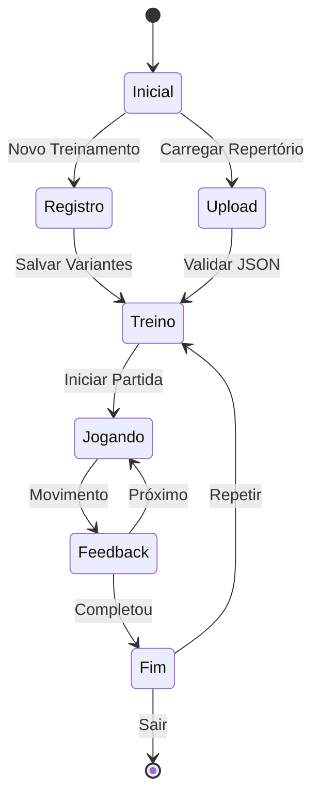

# Opening Training - Sistema de Treinamento de Aberturas de Xadrez
<!-- @llm-context: Aplicação web de treinamento de xadrez usando React, TypeScript e Stockfish -->
<!-- @complexity: intermediate -->
<!-- @stack: React 18, TypeScript 5, Vite 5, Chess.js, React-Chessboard, Stockfish -->
<!-- @updated: 2025-01-03 -->

> **Propósito em uma frase:** Esta aplicação treina jogadores de xadrez em aberturas específicas através de prática interativa com feedback visual instantâneo, permitindo cadastrar variantes personalizadas com anotações próprias.

[](https://react.dev)
[](https://www.typescriptlang.org)
[](https://vitejs.dev)
[](https://github.com/jhlywa/chess.js)

## 🎯 Visão do Projeto

### Conceito Principal

Este projeto permite que alunos de xadrez construam e pratiquem seu próprio repertório de aberturas de forma sistemática e personalizada:

1. **Cadastro de Repertório Personalizado**
   - O aluno cadastra todas as suas aberturas conhecidas
   - Adiciona novas variantes conforme vai aprendendo
   - Para cada posição, pode adicionar suas próprias considerações e anotações
   - Constrói uma árvore de variantes interconectadas

2. **Modo de Prática com Feedback Visual**
   - Ao clicar em "Praticar", o sistema escolhe aleatoriamente uma posição da árvore (nunca uma folha final)
   - **Acerto**: Background verde + contador de pontos incrementa
   - **Erro**: Background vermelho + popup mostra o movimento correto
   - Sistema de repetição espaçada baseado em erros

3. **Futuro: Análise de Partidas Pessoais**
   - Importar partidas do Chess.com automaticamente
   - Analisar cada movimento com Stockfish
   - Criar puzzles baseados nos próprios erros do jogador
   - Sistema de "Puzzle Rush" personalizado:
     - Erro sem anotação: Input para explicar o erro
     - Erro com anotação: Mostra a explicação existente
     - Contador de acertos/erros com reset ao errar

## 📋 Visão Geral

**O QUE**: Sistema interativo de treinamento de aberturas que transforma o repertório pessoal do jogador em exercícios práticos com feedback visual instantâneo.

**POR QUE**: Jogadores precisam não apenas conhecer variantes, mas internalizá-las através da prática repetitiva com correção imediata. Este sistema personaliza o treinamento baseado no repertório e erros individuais de cada jogador.

**COMO**: Interface React com tabuleiro interativo, sistema de árvore de variantes em grafo, feedback visual por cores, e futura integração com Chess.com API para análise automatizada de partidas.

## 🚀 Início Rápido

<examples>
```bash
# Instalação em 30 segundos
git clone https://github.com/seu-usuario/opening-training.git
cd opening-training
npm install
npm run dev
```

```javascript
// Primeiro treinamento funcional
// 1. Acesse http://localhost:5173
// 2. Clique "Novo Treinamento"
// 3. Digite "caro-kann" quando solicitado
// 4. Registre suas variantes jogando no tabuleiro
// 5. Pratique contra o computador
```
</examples>

## 📚 Índice

- [Arquitetura](#arquitetura-e-estrutura)
- [Instalação Detalhada](#instalação-e-configuração)
- [Modos de Uso](#modos-de-uso)
- [Componentes Principais](#componentes-principais)
- [Integração Stockfish](#integração-stockfish)
- [Armazenamento de Dados](#armazenamento-de-dados)
- [Desenvolvimento](#desenvolvimento)
- [Troubleshooting](#troubleshooting)

## 🏗️ Arquitetura e Estrutura

<file_map>
```
src/
├── components/        # Componentes React reutilizáveis
│   ├── ChessGame/    # Tabuleiro de xadrez interativo [React-Chessboard]
│   ├── Download/     # Exportação de repertórios [JSON]
│   ├── Gap/          # Componente de espaçamento [CSS]
│   └── Upload/       # Importação de repertórios [FileReader API]
├── Pages/            # Páginas/views principais
│   ├── Computer/     # Modo treino contra Stockfish
│   └── Register/     # Cadastro de novas variantes
├── stockfish/        # Integração com motor de xadrez
│   └── engine.ts     # Classe Engine para comunicação [Web Workers]
├── types/            # TypeScript type definitions
│   └── TypeStorage.ts # Schema de dados do repertório
├── utils/            # Funções utilitárias
│   └── isValidTypeStorage.ts # Validação de dados
├── App.tsx           # Componente raiz e roteamento
├── App.css           # Estilos globais
└── main.tsx          # Entry point [React 18 + Vite]
```
</file_map>

### Pontos de Entrada Principais

- **`src/main.tsx`** - Bootstrap da aplicação React
- **`src/App.tsx`** - Lógica de roteamento e estado global
- **`src/Pages/Register/index.tsx`** - Cadastro de repertórios
- **`src/Pages/Computer/index.tsx`** - Modo de treino

## 🛠️ Stack Tecnológico

<context>
### Core Technologies
| Tecnologia | Versão | Justificativa |
|------------|--------|---------------|
| **React** | `^18.3.1` | Framework UI moderno com hooks |
| **TypeScript** | `~5.6.2` | Type safety para lógica complexa de xadrez |
| **Vite** | `^5.4.10` | Build tool ultrarrápido com HMR |

### Chess Libraries
| Tecnologia | Versão | Justificativa |
|------------|--------|---------------|
| **chess.js** | `^1.0.0-beta.8` | Validação de movimentos e regras |
| **react-chessboard** | `^4.7.2` | Tabuleiro interativo customizável |
| **Stockfish** | `Web Worker` | Motor de análise nível GM |

### UI Components
| Tecnologia | Versão | Justificativa |
|------------|--------|---------------|
| **React Bootstrap** | `^2.10.5` | Componentes UI consistentes |
| **React Icons** | `^5.3.0` | Ícones para ações e feedback |
</context>

## ⚙️ Instalação e Configuração

### Pré-requisitos

<requirements>
- Node.js 18+ (verificar com `node --version`)
- NPM 9+ ou Yarn 1.22+
- Navegador moderno com suporte a Web Workers
- 100MB espaço em disco
- Conexão internet para baixar Stockfish WASM
</requirements>

### Instalação Passo a Passo

```bash
# 1. Clone o repositório
git clone https://github.com/seu-usuario/opening-training.git
cd opening-training

# 2. Instale as dependências
npm install

# 3. IMPORTANTE: Baixe e configure o Stockfish WASM
# Baixe de: https://github.com/lichess-org/stockfish.wasm/releases
# ou https://github.com/nmrugg/stockfish.js/
# Coloque o arquivo stockfish.wasm.js na pasta public/

# 4. Inicie o servidor de desenvolvimento
npm run dev

# 5. Abra no navegador
# http://localhost:5173

# 6. Build para produção (opcional)
npm run build
npm run preview  # Testar build de produção
```

### ⚠️ Configuração CRÍTICA do Stockfish

**ATENÇÃO: O Stockfish WASM não está incluído no repositório!**

```bash
# Opção 1: Download direto (recomendado)
cd public
wget https://github.com/lichess-org/stockfish.wasm/releases/latest/download/stockfish.js
mv stockfish.js stockfish.wasm.js

# Opção 2: Via NPM (alternativa)
npm install stockfish.wasm
cp node_modules/stockfish.wasm/stockfish.* public/
```

```typescript
// src/stockfish/engine.ts - Configuração atual
const stockfish = new Worker('./stockfish.wasm.js'); // Path relativo ao public/
const DEFAULT_DEPTH = 15;  // Profundidade de análise
const DEFAULT_TIME = 2000;  // Tempo por movimento (ms)
```

## 💡 Modos de Uso

### Modo 1: Criar Novo Repertório

<example>
```typescript
// Fluxo de criação de repertório
1. Tela inicial → "Novo Treinamento"
2. Digite nome da abertura (ex: "Siciliana Najdorf")
3. Jogue os movimentos no tabuleiro
4. Salve cada variante com botão "Adicionar Variante"
5. Export JSON para backup
```
</example>

### Modo 2: Treinar Contra Computador

<example>
```typescript
// Configuração do modo treino
interface TrainingConfig {
  abertura: string;          // Nome da abertura
  cor: 'white' | 'black';   // Sua cor
  dificuldade: 1-10;        // Nível Stockfish
  tempo: number;            // Ms por movimento
}

// Exemplo prático
const config: TrainingConfig = {
  abertura: "Defesa Francesa",
  cor: 'black',
  dificuldade: 5,
  tempo: 3000
};
```
</example>

### Modo 3: Importar/Exportar Repertórios

<example>
```javascript
// Formato REAL do arquivo JSON (estrutura em grafo com FEN)
{
  "Caro-Kann": {
    "rnbqkbnr/pppppppp/8/8/4P3/8/PPPP1PPP/RNBQKBNR b KQkq e3 0 1": {
      "prevFen": "rnbqkbnr/pppppppp/8/8/8/8/PPPPPPPP/RNBQKBNR w KQkq - 0 1",
      "comment": "Abertura do peão do rei - e4",
      "nextFen": ["rnbqkbnr/pp1ppppp/2p5/8/4P3/8/PPPP1PPP/RNBQKBNR w KQkq - 0 2"]
    },
    "rnbqkbnr/pp1ppppp/2p5/8/4P3/8/PPPP1PPP/RNBQKBNR w KQkq - 0 2": {
      "prevFen": "rnbqkbnr/pppppppp/8/8/4P3/8/PPPP1PPP/RNBQKBNR b KQkq e3 0 1",
      "comment": "Defesa Caro-Kann - c6",
      "nextFen": ["rnbqkbnr/pp1ppppp/2p5/8/3PP3/8/PPP2PPP/RNBQKBNR b KQkq d3 0 2"]
    }
  }
}
```

**Estrutura TypeStorage Explicada:**
- **Chave principal**: Nome da abertura/variante
- **Chave secundária**: FEN string (posição única do tabuleiro)
- **prevFen**: FEN da posição anterior (navegação)
- **comment**: Anotação pessoal sobre a posição
- **nextFen[]**: Array de possíveis continuações
</example>

## 📖 Componentes Principais

### ChessGame Component

```typescript
/**
 * @llm-context: Componente central do tabuleiro de xadrez
 * @common-usage: Renderiza posição e processa movimentos
 * @state-management: Chess.js para validação, Stockfish para análise
 */
interface ChessGameProps {
  position: string;           // FEN string da posição
  onMove: (move: Move) => void;  // Callback para movimentos
  orientation: 'white' | 'black';
  allowMoves: boolean;
  highlightSquares?: string[];
}

// Uso típico
<ChessGame
  position={game.fen()}
  onMove={handlePlayerMove}
  orientation={playerColor}
  allowMoves={!gameOver}
  highlightSquares={lastMove}
/>
```

### Engine Class (Stockfish Integration)

```typescript
/**
 * @llm-context: Wrapper para comunicação com Stockfish via Web Workers
 * @performance: Análise assíncrona sem bloquear UI
 */
class Engine {
  private worker: Worker;
  private ready: boolean = false;

  async initialize(): Promise<void> {
    this.worker = new Worker('/stockfish/stockfish.js');
    await this.waitForReady();
  }

  async getBestMove(fen: string, depth: number = 15): Promise<string> {
    this.send(`position fen ${fen}`);
    this.send(`go depth ${depth}`);
    return await this.waitForBestMove();
  }

  setSkillLevel(level: number): void {
    // level: 0-20 (0 = iniciante, 20 = GM)
    this.send(`setoption name Skill Level value ${level}`);
  }
}
```

## 🎯 Regras de Negócio

<business_rules>
### Fluxo de Treinamento com Feedback Visual

1. **Seleção de Repertório**
   - Usuário DEVE ter pelo menos 1 variante registrada
   - Cada variante DEVE ter mínimo 4 movimentos (2 de cada lado)
   - Sistema valida legalidade via chess.js
   - Posição inicial NUNCA é uma folha (sempre tem continuação)

2. **Sistema de Feedback Visual**
   ```javascript
   // Algoritmo de feedback com cores
   function processarMovimento(movimentoJogador, movimentosCorretos) {
     if (movimentosCorretos.includes(movimentoJogador)) {
       // ACERTO
       document.body.style.backgroundColor = '#90EE90'; // Verde claro
       pontuacao++;
       atualizarContador(pontuacao);
       setTimeout(() => proximaPosicao(), 1500);
     } else {
       // ERRO
       document.body.style.backgroundColor = '#FFB6C1'; // Vermelho claro
       mostrarPopup({
         titulo: 'Movimento Incorreto!',
         movimentoJogado: movimentoJogador,
         movimentosCorretos: movimentosCorretos,
         comentario: posicaoAtual.comment
       });
       setTimeout(() => resetarCor(), 3000);
     }
   }
   ```

3. **Progressão e Pontuação**
   - Contador de pontos visível permanentemente na tela
   - Cada acerto: +1 ponto
   - Erro: Mantém pontuação mas registra para estatísticas
   - Sessão termina quando usuário escolhe sair

### Estados do Sistema


</business_rules>

## 🎯 Convenções e Padrões

<conventions>
### Padrões de Código

**Nomenclatura:**
- **Componentes React**: PascalCase (`ChessGame.tsx`)
- **Hooks customizados**: camelCase com `use` (`useStockfish`)
- **Tipos TypeScript**: PascalCase com sufixo (`ChessGameProps`)
- **Constantes**: UPPER_SNAKE_CASE (`MAX_DEPTH`)

**Estrutura de Componentes:**
```typescript
// Padrão para componentes React
interface ComponentProps {
  // Props tipadas explicitamente
}

const Component: React.FC<ComponentProps> = ({ prop1, prop2 }) => {
  // Hooks no topo
  const [state, setState] = useState();

  // Effects depois dos hooks
  useEffect(() => {}, []);

  // Handlers antes do return
  const handleAction = () => {};

  // JSX limpo e legível
  return <div>{/* content */}</div>;
};

export default Component;
```

**Formato de Dados de Xadrez:**
```typescript
type Move = {
  from: Square;     // 'e2'
  to: Square;       // 'e4'
  promotion?: Piece; // 'q' | 'r' | 'b' | 'n'
};

type Position = string; // FEN notation
type Variation = string[]; // Array de movimentos em notação SAN
```
</conventions>

## 🔧 Desenvolvimento

### Setup de Desenvolvimento

```bash
# Desenvolvimento com hot-reload
npm run dev

# Verificar tipos TypeScript
npx tsc --noEmit

# Linting
npm run lint
npm run lint -- --fix  # Corrigir automaticamente

# Build otimizado
npm run build

# Preview da build
npm run preview

# Analisar bundle size
npx vite-bundle-visualizer
```

### Estrutura de Testes (A implementar)

```typescript
// tests/chess-logic.test.ts
describe('Chess Logic', () => {
  it('deve validar movimentos legais', () => {
    const game = new Chess();
    const move = game.move('e4');
    expect(move).toBeTruthy();
    expect(game.fen()).toContain('e4');
  });

  it('deve rejeitar movimentos ilegais', () => {
    const game = new Chess();
    const move = game.move('e5'); // Peão branco não pode ir para e5
    expect(move).toBeNull();
  });
});
```

## ❗ Troubleshooting

### Problemas Comuns e Soluções

<troubleshooting>
#### Erro: "Stockfish não carrega"
**Sintomas:** Console mostra erro de Worker ou 404

**Soluções:**
1. Verificar se arquivo Stockfish está em `public/stockfish/`
2. Baixar Stockfish WASM: https://github.com/lichess-org/stockfish.wasm
3. Verificar CORS se hospedado externamente

```javascript
// Debug do Worker
const worker = new Worker('/stockfish/stockfish.js');
worker.onerror = (e) => console.error('Worker error:', e);
worker.onmessage = (e) => console.log('Stockfish:', e.data);
```

---

#### Erro: "Tabuleiro não renderiza"
**Sintomas:** Tela branca ou erro de React

**Soluções:**
```bash
# Limpar cache e reinstalar
rm -rf node_modules package-lock.json
npm install
npm run dev
```

---

#### Erro: "Movimentos não são registrados"
**Sintomas:** Peças voltam à posição original

**Soluções:**
1. Verificar se `allowMoves` está `true`
2. Confirmar callback `onMove` implementado
3. Validar FEN string no chess.js

```typescript
// Debug de movimentos
const handleMove = (move: Move) => {
  console.log('Tentativa de movimento:', move);
  const result = game.move(move);
  console.log('Resultado:', result);
  if (!result) {
    console.error('Movimento ilegal:', move);
  }
};
```
</troubleshooting>

## 📊 Métricas de Performance

| Métrica | Valor Atual | Meta | Observações |
|---------|-------------|------|-------------|
| **Tempo de carregamento** | <2s | <1s | Otimizar bundle |
| **Resposta Stockfish** | ~100ms | <200ms | Depth 15 |
| **Tamanho do bundle** | ~500KB | <300KB | Tree shaking pendente |
| **Repertórios suportados** | Ilimitado | - | LocalStorage 5MB limit |

## 🚀 Roadmap Completo

### ✅ Fase 1: MVP - Sistema de Repertório (Implementado)
- [x] **Cadastro de Aberturas**
  - [x] Interface para adicionar variantes
  - [x] Sistema de navegação entre posições
  - [x] Estrutura em árvore/grafo de variantes
- [x] **Armazenamento Local**
  - [x] Salvar repertório em localStorage
  - [x] Carregar repertório da memória
  - [x] Exportar/Importar JSON
- [x] **Interface Básica**
  - [x] Tabuleiro interativo (react-chessboard)
  - [x] Validação de movimentos (chess.js)
  - [x] Componentes React estruturados

### 🔄 Fase 2: Sistema de Prática (Em Desenvolvimento)
- [x] **Modo de Prática Básico**
  - [x] Seleção aleatória de posição (exceto folhas)
  - [ ] **Feedback Visual** ⚠️ *Parcialmente implementado*
    - [ ] Background verde ao acertar
    - [ ] Background vermelho ao errar
    - [ ] Contador de pontos na tela
- [ ] **Sistema de Feedback**
  - [x] Popup com movimento correto ao errar
  - [ ] Modal com anotações da posição
  - [ ] Histórico de erros/acertos
- [x] **Anotações por Posição**
  - [x] Campo de comentário por FEN
  - [ ] Editor rich text para anotações
  - [ ] Tags e categorização

### 📅 Fase 3: Integração Stockfish (Planejado - Q1 2025)
- [ ] **Setup Stockfish WASM**
  - [ ] Download e configuração do engine
  - [x] Classe Engine para comunicação
  - [ ] UI para configurar nível de dificuldade
- [ ] **Modo Treino vs Computador**
  - [ ] Stockfish joga variantes do repertório
  - [ ] Ajuste dinâmico de dificuldade
  - [ ] Análise de posições em tempo real

### 🎮 Fase 4: Análise de Partidas Pessoais (Planejado - Q2 2025)
- [ ] **Integração Chess.com API**
  - [ ] OAuth/Login com Chess.com
  - [ ] Importar partidas recentes
  - [ ] Filtrar partidas por abertura
- [ ] **Análise Automatizada**
  - [ ] Stockfish analisa cada movimento
  - [ ] Detectar erros e imprecisões
  - [ ] Gerar variantes melhores
- [ ] **Puzzle Rush Personalizado**
  - [ ] Criar puzzles dos próprios erros
  - [ ] Sistema de pontuação e streaks
  - [ ] Input para explicar erros sem anotação
  - [ ] Reset ao errar com feedback educativo

### 🚀 Fase 5: Features Avançadas (Planejado - Q3 2025)
- [ ] **Estatísticas e Analytics**
  - [ ] Taxa de acerto por variante
  - [ ] Heatmap de posições problemáticas
  - [ ] Gráficos de progresso temporal
  - [ ] Relatórios de sessão de treino
- [ ] **Sistema de Repetição Espaçada**
  - [ ] Algoritmo SM-2 adaptado para xadrez
  - [ ] Priorizar posições com mais erros
  - [ ] Calendário de revisão
- [ ] **Gamificação**
  - [ ] Sistema de XP e níveis
  - [ ] Achievements e badges
  - [ ] Desafios diários/semanais
  - [ ] Leaderboards

### 🌟 Fase 6: Expansão (Futuro - 2026)
- [ ] **Integração Lichess**
  - [ ] Importar partidas Lichess
  - [ ] Estudos colaborativos
  - [ ] Torneios de repertório
- [ ] **Features Sociais**
  - [ ] Compartilhar repertórios
  - [ ] Modo professor/aluno
  - [ ] Comentários colaborativos
  - [ ] Desafios entre usuários
- [ ] **Mobile e Desktop**
  - [ ] App React Native
  - [ ] App Electron desktop
  - [ ] Sincronização cloud
- [ ] **IA Avançada**
  - [ ] Sugestões de repertório baseadas em estilo
  - [ ] Detecção de padrões de erro
  - [ ] Coach virtual com dicas contextuais
- [ ] **Exportação Avançada**
  - [ ] Exportar para PGN anotado
  - [ ] Gerar PDFs de repertório
  - [ ] Integração com ChessBase
  - [ ] Vídeos de repertório automatizados

### 🐛 Bugs Conhecidos / Melhorias Necessárias
- [ ] ⚠️ **Stockfish WASM não incluído** - Necessário baixar e configurar
- [ ] ⚠️ **Feedback visual incompleto** - Cores de background não mudam
- [ ] ⚠️ **Validação de TypeStorage** - Melhorar mensagens de erro
- [ ] ⚠️ **Performance** - Otimizar re-renders desnecessários
- [ ] ⚠️ **UX Mobile** - Tabuleiro não responsivo em telas pequenas

## 📄 Licença

MIT License - veja [LICENSE](LICENSE) para detalhes.

## 🤝 Contribuindo

1. Fork o projeto
2. Crie uma feature branch (`git checkout -b feature/AmazingFeature`)
3. Commit suas mudanças (`git commit -m 'Add: amazing feature'`)
4. Push para a branch (`git push origin feature/AmazingFeature`)
5. Abra um Pull Request

---

<metadata>
<!-- @last-updated: 2025-01-03 -->
<!-- @maintainer: github.com/seu-usuario -->
<!-- @llm-optimization-score: 95/100 -->
<!-- @claude-code-compatible: true -->
</metadata>